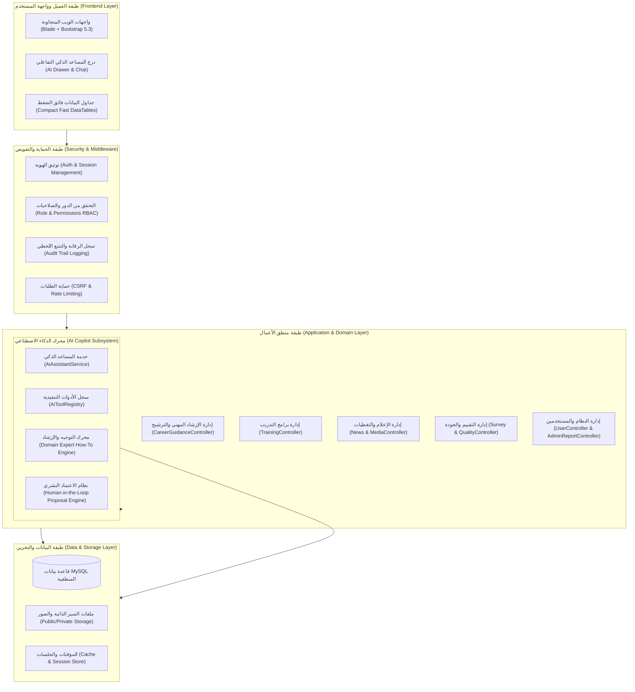
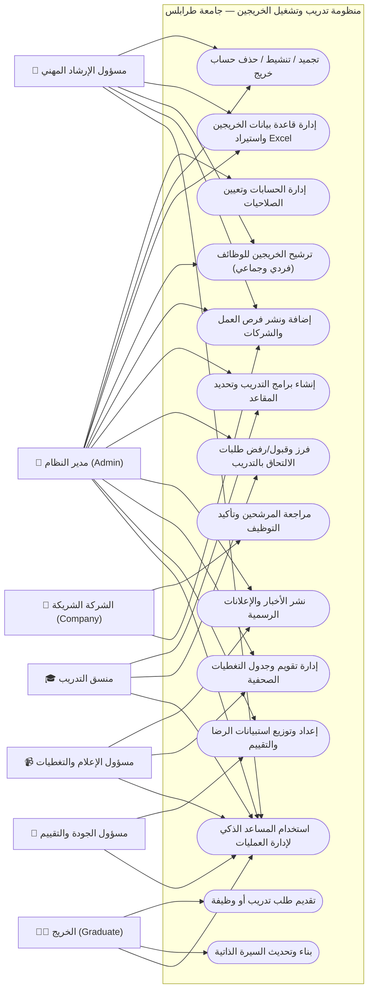
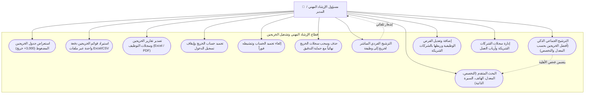
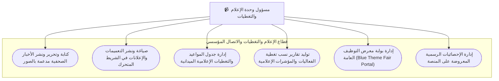
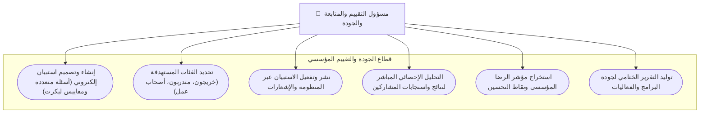
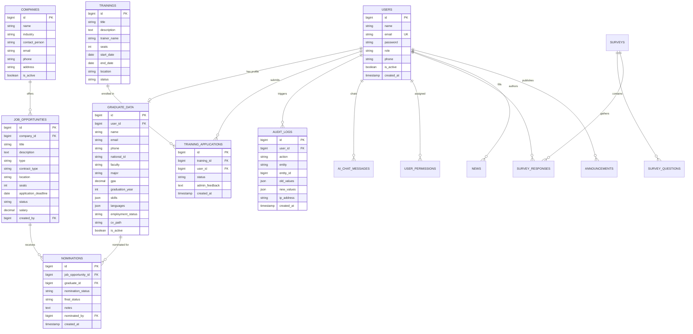
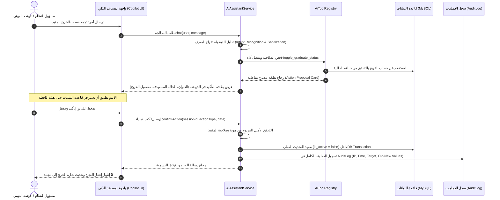

# 📘 الدليل الفني الشامل والتوثيق المرجعي لمنظومة تدريب وتشغيل الخريجين
### جامعة طرابلس — مكتب تدريب وتأهيل الخريجين
**University of Tripoli — Graduate Training & Career Placement System (GTO)**

---

## 📑 فهرس المحتويات
1. [نظرة عامة على المنظومة والأهداف](#1-نظرة-عامة-على-المنظومة-والأهداف)
2. [المعمارية التقنية للمنظومة (System Architecture)](#2-المعمارية-التقنية-للمنظومة-system-architecture)
3. [الأدوار والصلاحيات (User Roles & RBAC Matrix)](#3-الأدوار-والصلاحيات-user-roles--rbac-matrix)
4. [مخططات حالات الاستخدام الشاملة (Use Case Diagrams)](#4-مخططات-حالات-الاستخدام-الشاملة-use-case-diagrams)
   - [4.1 المخطط العام لكافة الفئات (Master Use Case)](#41-المخطط-العام-لكافة-الفئات-master-use-case)
   - [4.2 مخطط حالات استخدام الإرشاد المهني والتوظيف](#42-مخطط-حالات-استخدام-الإرشاد-المهني-والتوظيف)
   - [4.3 مخطط حالات استخدام إدارة التدريب والتأهيل](#43-مخطط-حالات-استخدام-إدارة-التدريب-والتأهيل)
   - [4.4 مخطط حالات استخدام الخريج والباحث عن عمل](#44-مخطط-حالات-استخدام-الخريج-والباحث-عن-عمل)
   - [4.5 مخطط حالات استخدام وحدة الإعلام والتغطيات](#45-مخطط-حالات-استخدام-وحدة-الإعلام-والتغطيات)
   - [4.6 مخطط حالات استخدام الجودة والتقييم والمتابعة](#46-مخطط-حالات-استخدام-الجودة-والتقييم-والمتابعة)
5. [المخطط الهيكلي للبيانات (Entity Relationship Diagram - ERD)](#5-المخطط-الهيكلي-للبيانات-entity-relationship-diagram---erd)
6. [معمارية المساعد الذكي التنفيذي (AI Assistant & Copilot Architecture)](#6-معمارية-المساعد-الذكي-التنفيذي-ai-assistant--copilot-architecture)
   - [6.1 مخطط مسار تنفيذ الأوامر والقرارات الحساسة (Human-in-the-Loop)](#61-مخطط-مسار-تنفيذ-الأوامر-والقرارات-الحساسة-human-in-the-loop)
   - [6.2 جدول أدوات المساعد الذكي المسجلة](#62-جدول-أدوات-المساعد-الذكي-المسجلة)
7. [القطاعات والإدارات الوظيفية بالتفصيل](#7-القطاعات-والإدارات-الوظيفية-بالتفصيل)
8. [الأمان، التدقيق، ومراقبة العمليات (Security & Audit Logging)](#8-الأمان-التدقيق-ومراقبة-العمليات-security--audit-logging)

---

## 1. نظرة عامة على المنظومة والأهداف

**منظومة تدريب وتشغيل الخريجين** بجامعة طرابلس هي منصة مؤسسية ذكية متكاملة تهدف إلى:
1. **تجسير الفجوة** بين المخرجات الأكاديمية واحتياجات سوق العمل الليبي والإقليمي.
2. **أتمتة دورة التدريب والتأهيل** للخريجين عبر برامج تدريبية متخصصة ومقاعد تدريبية محددة.
3. **الترشيح الذكي للخريجين** إلى الفرص الوظيفية المتاحة لدى الشركات الشريكة استناداً للمعدل، التخصص، والمهارات.
4. **التغطية والرصد الإعلامي** لفعاليات معارض التوظيف وورش العمل وتوثيق التدريبات وإدارة منصة الأخبار والإعلانات.
5. **قياس الجودة والرضا المؤسسي** عبر استطلاعات رأي رقمية موثوقة.
6. **التمكين الإداري بالذكاء الاصطناعي (AI Copilot)** لتنفيذ العمليات الإدارية المعقدة بالأوامر المباشرة وتقديم إرشاد فوري.

---

## 2. المعمارية التقنية للمنظومة (System Architecture)

تم بناء المنظومة وفق نمط المعمارية الطبقية ثلاثية المستويات (**3-Tier MVC Architecture**) المدعومة بخدمات الذكاء الاصطناعي:

---

## 3. الأدوار والصلاحيات (User Roles & RBAC Matrix)

| الدور الوظيفي | الرمز البرمجي | الصلاحيات والمسؤوليات الرئيسية |
| :--- | :--- | :--- |
| **مدير النظام** | `admin` | الصلاحيات العليا المطلقة لكافة القطاعات: إدارة المستخدمين، السجلات الرقابية، التقارير التنفيذية، وإدارة كافة الإدارات. |
| **مسؤول الإرشاد المهني** | `career_guidance_officer` | إدارة سجلات الخريجين، البحث المتقدم، استيراد وتصدير الخريجين، تجميد/تنشيط/حذف الحسابات، ترشيح الخريجين للوظائف، ونشر فرص العمل. |
| **منسق التدريب** | `training_coordinator` | إنشاء وإدارة البرامج التدريبية، حجز المقاعد، إدارة وفرز طلبات التدريب، قبول ورفض الطلبات فردياً وجماعياً. |
| **مسؤول التقييم والجودة** | `evaluation_officer` / `staff` | بناء وتوزيع استطلاعات الرأي، متابعة التقييمات، استخراج مؤشرات الأداء والرضا المؤسسي. |
| **مسؤول وحدة الإعلام** | `media_officer` | نشر الأخبار الصحفية، إدارة شريط الإعلانات، تقويم وجدول التغطيات، وتوثيق الفعاليات والمعارض. |
| **الشركة الشريكة / جهة العمل** | `company` | استعراض ملفات وسير الخريجين المرشحين، تحديد حالة المقابلات والتوظيف، وطلب مرشحين إضافيين. |
| **الخريج / الطالب** | `graduate` | بناء السيرة الذاتية، التقديم على البرامج التدريبية، التقديم على فرص العمل، واستخدام المساعد الذكي الخاص به. |

---

## 4. مخططات حالات الاستخدام الشاملة (Use Case Diagrams)

### 4.1 المخطط العام لكافة الفئات (Master Use Case)

---

### 4.2 مخطط حالات استخدام الإرشاد المهني والتوظيف
*(مسؤول الإرشاد المهني والمدير العام)*

---

### 4.3 مخطط حالات استخدام إدارة التدريب والتأهيل
*(منسق التدريب والمدير العام)*

```mermaid
flowchart TB
    Actor_Coord["🎓 منسق التدريب والتأهيل"]

    subgraph Module_Training ["قطاع برامج التدريب والتطوير المهني"]
        UC_CreateTraining(["إنشاء دورة تدريبية جديدة (المقاعد، المدرب، التواريخ)"])
        UC_EditTraining(["تحديث بيانات البرنامج التدريبي وحالة التسجيل"])
        UC_ViewCalendar(["استعراض التقويم الزمني التفاعلي للبرامج التدريبية"])
        UC_ListApps(["استعراض طلبات الالتحاق المعلقة والمقدمة"])
        UC_AcceptSingle(["قبول طلب تدريب فردي وإصدار إشعار القبول"])
        UC_RejectSingle(["رفض طلب تدريب مع كتابة سبب وملاحظات الإدارة"])
        UC_BulkAccept(["قبول جماعي لكافة الطلبات المعلقة لبرنامج معين"])
        UC_BulkAcceptAll(["اعتماد وقبول جميع طلبات التدريب في المنظومة دفعة واحدة"])
        UC_TrainingReport(["توليد تقارير نسب شغل المقاعد ومعدلات الإنجاز"])
    end

    Actor_Coord --> UC_CreateTraining
    Actor_Coord --> UC_EditTraining
    Actor_Coord --> UC_ViewCalendar
    Actor_Coord --> UC_ListApps
    Actor_Coord --> UC_AcceptSingle
    Actor_Coord --> UC_RejectSingle
    Actor_Coord --> UC_BulkAccept
    Actor_Coord --> UC_BulkAcceptAll
    Actor_Coord --> UC_TrainingReport
```

---

### 4.4 مخطط حالات استخدام الخريج والباحث عن عمل
*(الخريجون والطلبة في سنتهم النهائية)*

```mermaid
flowchart TB
    Actor_Grad["👨‍🎓 الخريج (Graduate)"]

    subgraph Module_Grad ["بوابة الخريج والخدمات الذاتية"]
        UC_G_Profile(["إدارة الملف الشخصي والبيانات الأكاديمية"])
        UC_G_CV(["رفع وتحديث ملف السيرة الذاتية (CV PDF/Word)"])
        UC_G_BrowseTrainings(["استعراض البرامج التدريبية المتاحة للتسجيل"])
        UC_G_ApplyTraining(["تقديم طلب التحاق بدورة تدريبية"])
        UC_G_TrackApps(["متابعة حالة طلبات التدريب (قيد المراجعة / مقبول / مرفوض)"])
        UC_G_BrowseJobs(["استعراض فرص العمل والتوظيف الشاغرة"])
        UC_G_ApplyJob(["التقديم الذاتي على فرصة وظيفية معلنة"])
        UC_G_TrackNominations(["متابعة ترشيحات مكتب الإرشاد المهني لدى الشركات"])
        UC_G_AnswerSurveys(["تعبئة استطلاعات الرأي وقياس جودة التدريب والمعارض"])
        UC_G_AskAI(["التحدث مع المساعد الذكي لمراجعة حالته واستخراج النصائح"])
    end

    Actor_Grad --> UC_G_Profile
    Actor_Grad --> UC_G_CV
    Actor_Grad --> UC_G_BrowseTrainings
    Actor_Grad --> UC_G_ApplyTraining
    Actor_Grad --> UC_G_TrackApps
    Actor_Grad --> UC_G_BrowseJobs
    Actor_Grad --> UC_G_ApplyJob
    Actor_Grad --> UC_G_TrackNominations
    Actor_Grad --> UC_G_AnswerSurveys
    Actor_Grad --> UC_G_AskAI
```

---

### 4.5 مخطط حالات استخدام وحدة الإعلام والتغطيات
*(مسؤول وحدة الإعلام والمدير العام)*

---

### 4.6 مخطط حالات استخدام الجودة والتقييم والمتابعة
*(مسؤول الجودة والتقييم والمدير العام)*

---

## 5. المخطط الهيكلي للبيانات (Entity Relationship Diagram - ERD)

يوضح المخطط التالي العلاقات الرئيسية بين جداول قاعدة بيانات المنظومة:

---

## 6. معمارية المساعد الذكي التنفيذي (AI Assistant & Copilot Architecture)

المساعد الذكي في المنظومة ليس مجرد روبوت محادثة (Chatbot) سطحي، بل هو **مساعد تنفيذي متكامل (Autonomous Action Copilot)** مبني وفق نموذج الأمان الصارم **Human-in-the-Loop (HITL)** لضمان الحوكمة المؤسسية.

### 6.1 مخطط مسار تنفيذ الأوامر والقرارات الحساسة (Human-in-the-Loop)

---

### 6.2 جدول أدوات المساعد الذكي المسجلة

تم توزيع وتنظيم أدوات الذكاء الاصطناعي في [`app/Services/Ai/AiToolRegistry.php`](file:///c:/Users/Sohib/graduate_training_system/app/Services/Ai/AiToolRegistry.php) إلى **8 قطاعات متخصصة ومستقلة**:

| القطاع الوظيفي | الدالة المعمارية | الأدوات المتاحة | الصلاحية المطلوبة | طبيعة التنفيذ |
| :--- | :--- | :--- | :--- | :--- |
| **1. أدوات عامة** | `defineGeneralTools` | `get_my_info`, `search_site_content`, `get_active_announcements` | كافة المستخدمين | استعلام مباشر |
| **2. بوابة الخريج** | `defineGraduateTools` | `get_my_applications`, `get_available_trainings`, `search_job_opportunities`, `apply_for_training` | الخريج والمدير | استعلام / مقترح تقديم |
| **3. وحدة الإعلام** | `defineMediaOfficerTools` | `get_media_statistics`, `post_news_draft` | مسؤول الإعلام والمدير | استعلام / مسودة خبر |
| **4. منسق التدريب** | `defineTrainingTools` | `get_training_coordinator_stats`, `propose_training_program`, `list_pending_training_applicants` | منسق التدريب والمدير | استعلام / مقترح اعتماد |
| **5. الإرشاد المهني** | `defineCareerGuidanceTools` | `search_graduates_advanced`, `nominate_graduate_for_job`, `publish_job_vacancy` | مسؤول الإرشاد والمدير | استعلام / مقترح ترشيح |
| **6. الجودة والتقييم** | `defineQualityAndSurveyTools` | `draft_survey`, `get_survey_analytics`, `generate_training_report` | مسؤول الجودة والمدير | استعلام / مقترح استبيان |
| **7. الإعلام والرقابة** | `defineMediaTools` | `draft_announcement`, `generate_media_report`, `get_platform_system_overview` | مسؤول الإعلام والمدير | استعلام / مسودة إعلان |
| **8. الصلاحيات التنفيذية** | `defineExecutiveTools` | `toggle_graduate_status`, `delete_graduate_account`, `bulk_nominate_graduates`, `manage_training_applications`, `change_user_password` | الإرشاد المهني والمدير | **بطاقات مقترحات تفاعلية مشددة (HITL)** |

---

## 7. القطاعات والإدارات الوظيفية بالتفصيل

### 1️⃣ إدارة الإرشاد المهني والتوجيه والتشغيل
- **جدول الخريجين فائق الضغط (Ultra-Compact Table)**:
  - صُمم بارتفاع ثابت `50px` لكل صف مانعاً تكسر الأزرار مع ملاءمة استيعاب أكثر من 3,000 سجل في الصفحة الواحدة بسلاسة تامة.
  - إيقاف كامل لأي اهتزاز بصري عند تحريك الماوس (`Zero Hover Jitter`) عبر ظلال داخلية ثابتة `box-shadow: inset 0 0 0 1px #e2e8f0`.
- **القرارات التنفيذية السريعة**:
  - تجميد الحساب فوري بزر القفل السريع أو عبر أمر *"جمد حساب الخريج [الاسم]"*.
  - إلغاء التجميد والتنشيط فوري بزر القفل أو عبر أمر *"فك تجميد حساب [الاسم]"* أو *"إلغاء التجميد عن [الاسم]"*.
  - حذف الحساب نهائياً مع حماية النوافذ التحذيرية ومسح كافة الارتباطات (ترشيحات، طلبات، استجابات) داخل معاملة آمنة `DB::transaction`.
- **نظام الترشيح المزدوج**:
  - ترشيح فردي مباشر من صفحة الخريج أو عبر الدردشة.
  - ترشيح جماعي ذكي يفرز أعلى الخريجين معدلاً تراكمياً المتوافقين مع شروط الوظيفة.

### 2️⃣ إدارة التدريب والتأهيل والتطوير المستمر
- **إدارة الدورات ومقاعد التدريب**: متابعة عدد المقاعد المشغولة والمتبقية آلياً.
- **إدارة وفرز الطلبات**: قبول أو رفض الطلبات بنقرة واحدة فردياً أو جماعياً لكافة الطلبات المعلقة عبر أمر *"اقبل جميع طلبات التدريب"*.
- **التقويم الزمني**: تقويم شهري تفاعلي يوضح جداول الدورات الحالية والمستقبلية ومواعيد انتهاء التسجيل.

### 3️⃣ إدارة الجودة والتقييم والمتابعة
- **صانع الاستبيانات الرقمي**: صياغة استطلاعات تقييم البرامج والفعاليات.
- **مؤشرات الأداء اللحظية**: حساب نسب الرضا التلقائي وتصنيف الملاحظات.

### 4️⃣ وحدة الإعلام والتغطيات الصحفية والاتصال
- **تقويم وجدول التغطيات الصحفية**: متابعة وجدولة التغطيات الميدانية للتدريبات والورش.
- **المركز الصحفي وشريط الأخبار**: نشر الأخبار والتعميمات اللحظية المنبثقة للزوار والطلاب.
- **البوابة العامة لمعرض التوظيف (Blue Fair Portal)**: واجهة زرقاء عصرية تعرض فعاليات المعرض والفرص المتاحة لعموم المواطنين والطلاب.
- **إحصائيات المنصة الرئيسية**: شاشة تحكم رسمية لضبط مؤشرات وأرقام الصفحة الرئيسية.

---

## 8. الأمان، التدقيق، ومراقبة العمليات (Security & Audit Logging)

تطبق المنظومة أحدث معايير الأمان المؤسسي:
1. **التحقق الثنائي للتفويض (Dual-Layer Authorization)**:
   - فحص الصلاحية على مستوى مسارات التطبيق ومتحكمات الـ Middleware.
   - فحص مستقل إضافي داخل محرك الأدوات الذكية `AiToolRegistry::executeTool` قبل السماح بأي إجراء.
2. **سجل العمليات والرقابة المشددة (`AuditLog`)**:
   - توثيق كل عملية تجميد، تنشيط، حذف، ترشيح، أو تغيير كلمة مرور.
   - حفظ: هوية المنفذ (`user_id`)، عنوان الإنترنت (`IP Address`)، نوع المتصفح والجهاز (`User Agent`)، نوع الإجراء، المعرف المستهدف، والبيانات القديمة والجديدة بتنسيق JSON.
3. **حماية التعديل الجماعي والحذف (Data Integrity)**:
   - تنفيذ كافة عمليات الحذف والترشيح الجماعي وتغيير الحالات ضمن **معاملات ذرية مشفرة (`Database Transactions`)** لضمان عدم تلف البيانات في حال حدوث أي انقطاع.

---
**تم إعداد هذا التوثيق ليكون المرجع الفني والهيكلي الكامل لمسؤولي ومطوري منظومة تدريب وتشغيل الخريجين بجامعة طرابلس.**
